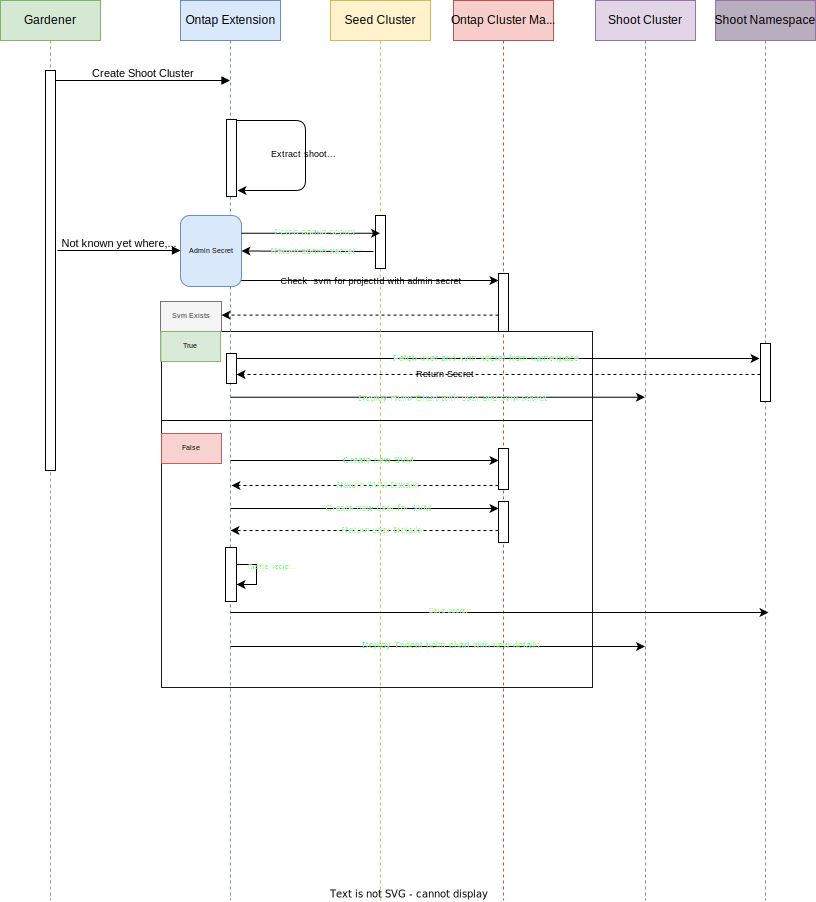

# Gardener Extension for NetApp ONTAP CSI Plugin

This repository contains the Gardener extension controller for managing the NetApp ONTAP CSI Plugin.

## Development Workflow

### Prerequisites

- A local Gardener setup.

### Steps to Run Locally

1. **Clone the Gardener Repository**

```bash
git clone git@github.com:gardener/gardener.git
```

2. Set Up Gardener Locally

### Start a local Kubernetes cluster:

```bash
make kind-up
```

1. Deploy Gardener:

```bash
    make gardener-up
```

2. Generate Helm Charts

Run the following command to generate the required Helm charts:
```bash
make generate
```

### Deploy the Example Configuration

1. Apply the example configuration to your Gardener setup:
```bash
kubectl apply -k example/
```

2. Apply the shoot cluster configuration:
```bash
kubectl apply -f example/shoot.yaml
```

### Pushing Code Changes Locally

When making changes to the code, you can build and deploy the changes locally using:

```bash
make push-to-gardener-local
```


# Sequence Diagram




# Notes

doc.go has been temporarily modified to bypass the use of VERSION. This needs to be fixed.

./hack/usage/delete shoot local  garden-local # Deleting shoot cluster


kubectl -n garden-<project-name> annotate shoot <shoot-name> gardener.cloud/operation=reconcile


Still a bug:

    Message:               error during apply of object "v1/ServiceAccount/trident/trident-operator": unable to get: trident/trident-operator because of unknown namespace for the cache

make fetch virtuail k in metal deployment im controlplane directory, damit ich k create -k example/ für die ontap extension mache


./hack/usage/generate-admin-kubeconf.sh > admin-kubeconf.yaml


# For data LIF
network interface create -vserver b5f26a3b9a4d48dba6b3d1dd4ac4abec -lif data_lif -address 192.168.10.40 -netmask 255.255.255.0 -home-node fsqe-snc1-01 -home-port e0b -status-admin up

# For management LIF
network interface create -vserver b5f26a3b9a4d48dba6b3d1dd4ac4abec -lif mgmt_lif -address 192.168.10.41 -netmask 255.255.255.0 -home-node fsqe-snc1-01 -home-port e0b -firewall-policy mgmt -status-admin up


apiVersion: trident.netapp.io/v1
kind: TridentBackendConfig
metadata:
  name: ontap-backend
  namespace: kube-system
spec:
  version: 1
  backendName: testName
  storageDriverName: ontap-nas
  managementLIF: 192.168.10.11
  dataLIF: 192.168.10.21
  svm: vs1
  credentials:
    name: ontap-credentials


apiVersion: v1
kind: Secret
metadata:
  name: ontap-credentials
  namespace: kube-system
type: Opaque
data:
  password: ZnNxZTIwMjA=
  username: YWRtaW4=


kind: PersistentVolumeClaim
apiVersion: v1
metadata:
  name: basic
spec:
  accessModes:
    - ReadWriteOnce
  resources:
    requests:
      storage: 1Gi
  storageClassName: ontap-gold
